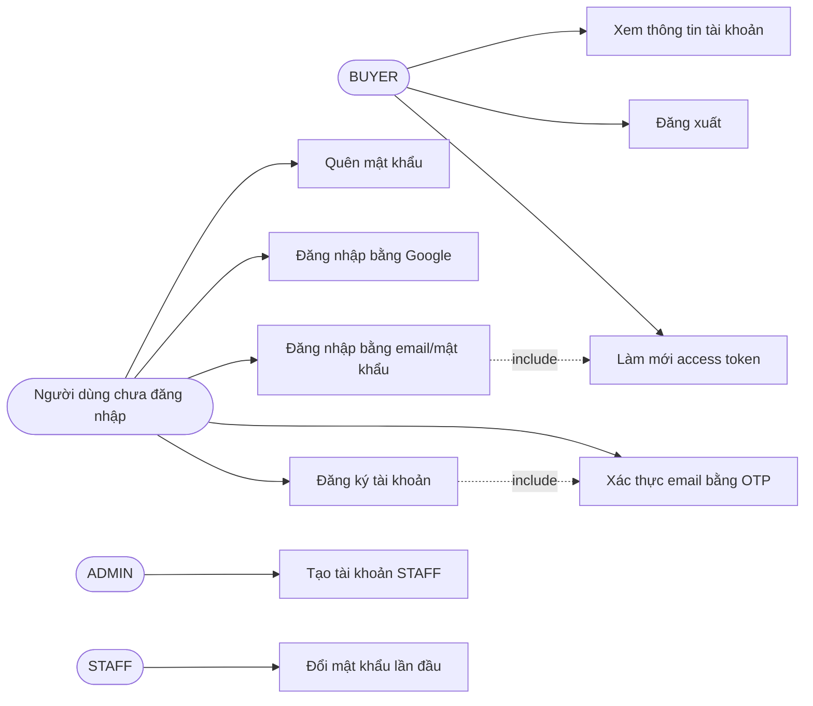
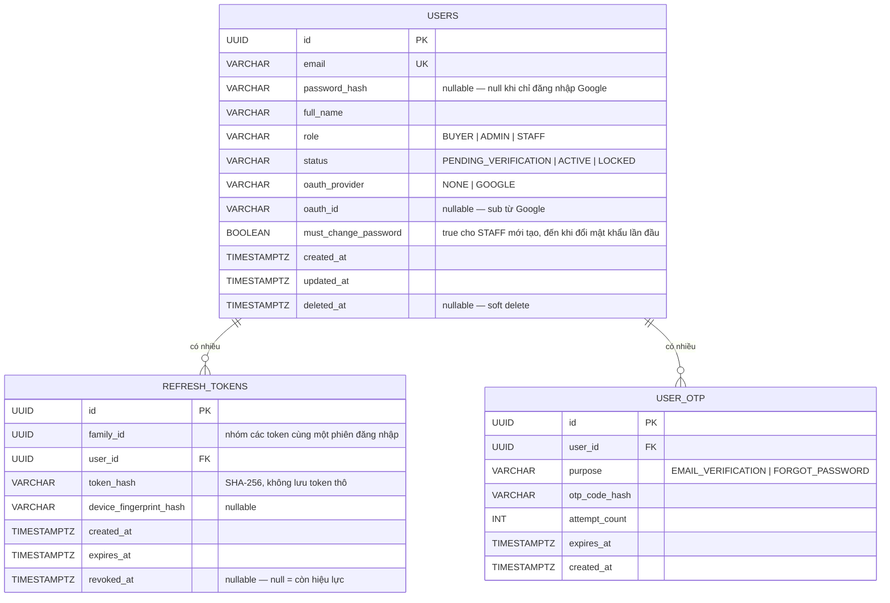
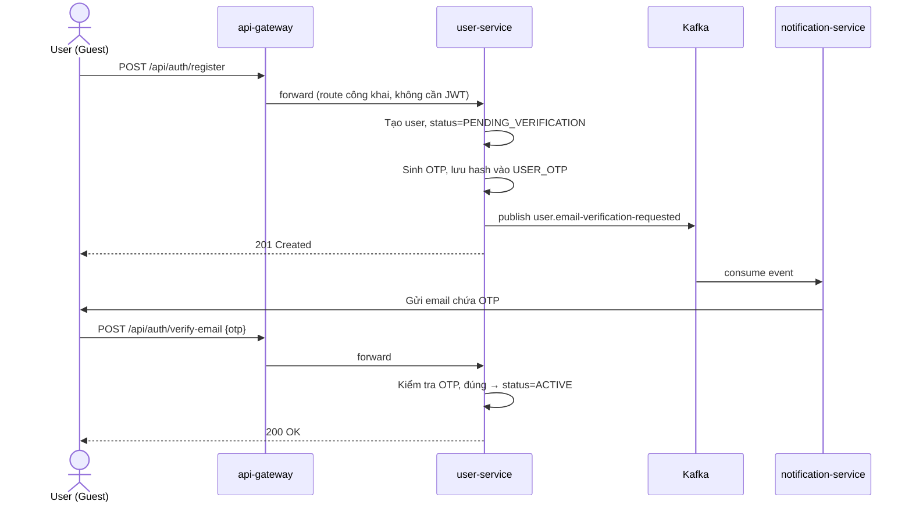
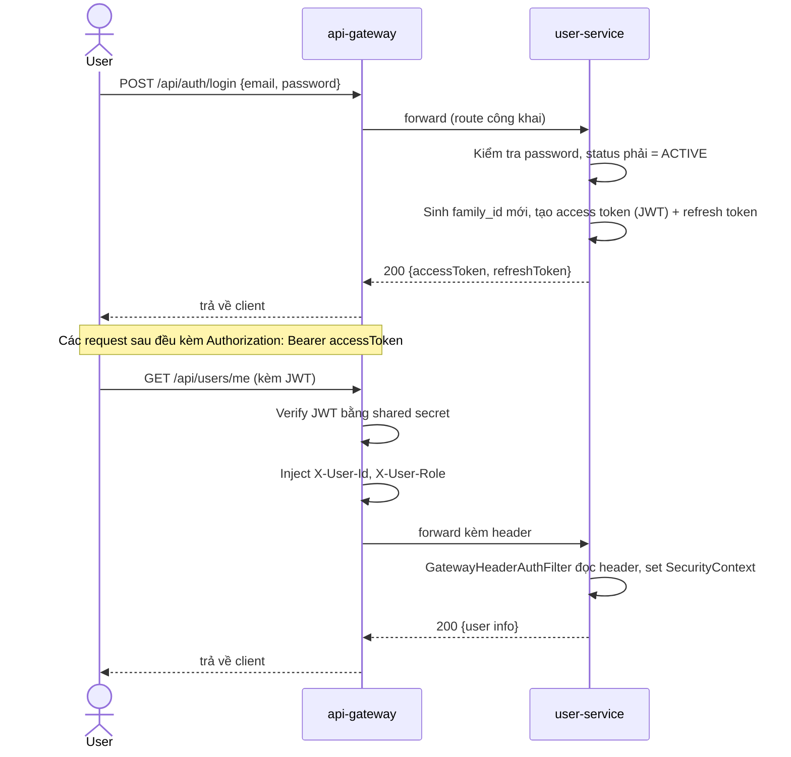
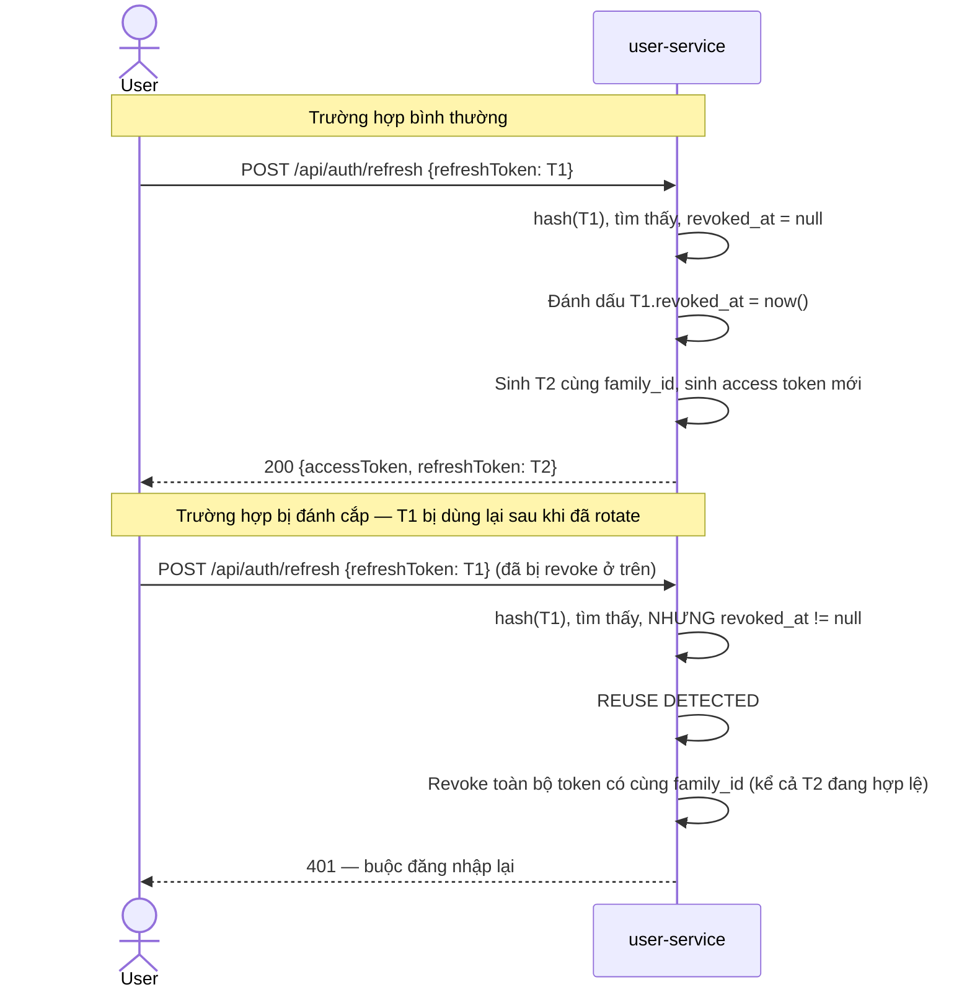
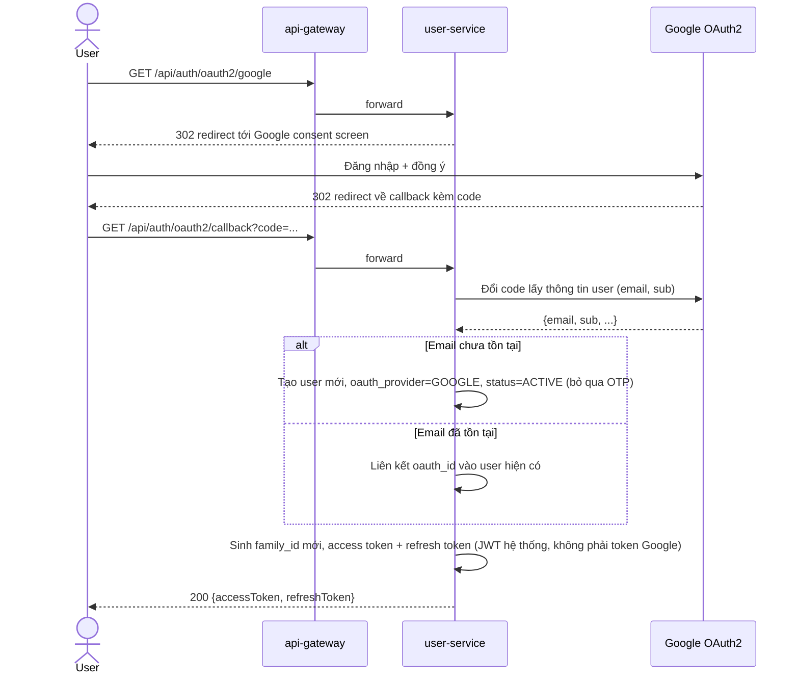
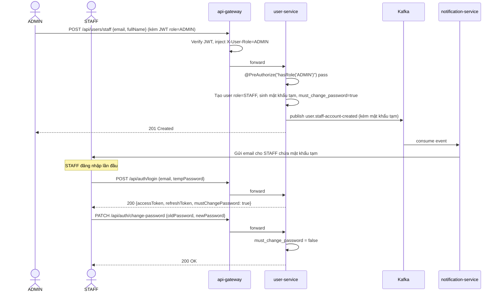
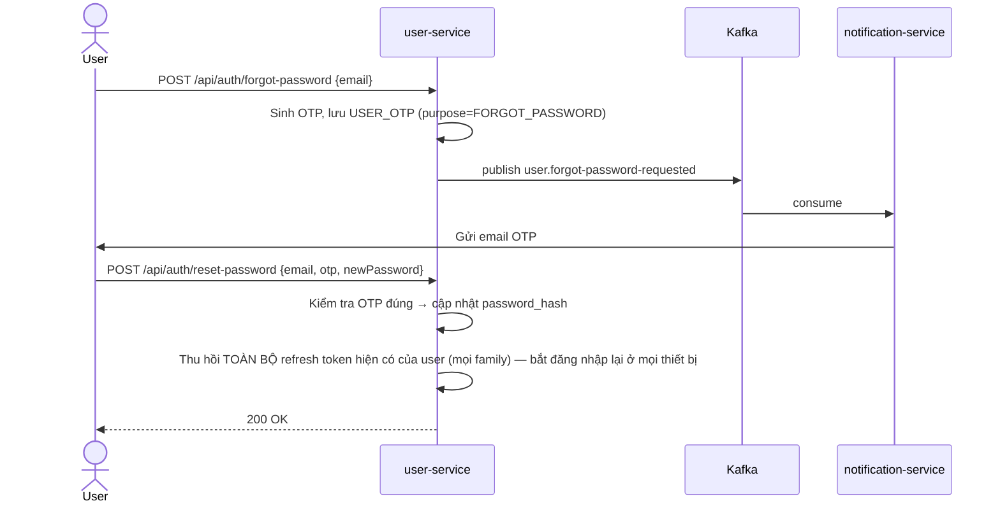

# Vantix — Phase 1: User & Auth — Tài liệu thiết kế

> **Trạng thái:** Thiết kế — dùng để code theo, chưa phải tài liệu tổng kết sau khi làm xong.
> **Liên quan:** `00_roadmap_phases_v1.md` (mục P1), `P0_infrastructure_summary.md`

---

## 1. Quyết định thiết kế đã chốt (bối cảnh cho các phần sau)

| # | Quyết định |
|---|---|
| 1 | Refresh token dùng **rotation + reuse detection theo family** (xem mục 3.3 để hiểu cơ chế, mục 4 cho schema) |
| 2 | Email chưa xác thực → `status = PENDING_VERIFICATION`, **chặn đăng nhập** hoàn toàn |
| 3 | OAuth2 Google xử lý trong `user-service`; sau khi Google xác thực, `user-service` **tự phát hành JWT hệ thống** (không dùng token Google làm session); tài khoản qua Google tự động coi như đã xác thực email |
| 4 | ADMIN tạo tài khoản STAFF → hệ thống sinh **mật khẩu tạm**, gửi qua email (Kafka → Notification), STAFF bắt buộc đổi mật khẩu ở lần đăng nhập đầu |
| 5 | Quên mật khẩu dùng chung pattern OTP-qua-email như xác thực đăng ký |
| 6 | Mô hình JWT: Gateway verify, inject `X-User-Id`/`X-User-Role`; service downstream dùng `GatewayHeaderAuthFilter` (đã có từ `commonlib-security`), không tự verify JWT |

---

## 2. Use case tổng quát

**Ghi chú:** SELLER chưa có ở Phase 1, không xuất hiện trong use case này (theo phạm vi đã chốt ở roadmap).

---

## 3. ERD

**Ghi chú thiết kế:**
- `USER_OTP` là bảng, **không phải Redis**, khác với OTP thiết bị mới ở dự án trước (vốn dùng Redis TTL). Lý do: OTP xác thực email/quên mật khẩu cần audit lâu hơn (biết ai đã xác thực khi nào), trong khi Redis phù hợp hơn cho dữ liệu tồn tại rất ngắn và không cần truy vết. Bạn có thể đổi sang Redis nếu muốn nhất quán tuyệt đối với cách làm OTP cũ — đây là điểm mở, nói với mình nếu muốn đổi.
- `email` chỉ unique khi `deleted_at IS NULL` (cho phép tạo lại email đã bị xóa mềm) — cần thể hiện bằng partial unique index khi viết migration, không phải constraint thường.

---

## 4. Sequence diagram — các luồng chính

### 4.1 Đăng ký + xác thực email

### 4.2 Đăng nhập bằng email/mật khẩu — có JWT qua Gateway

### 4.3 Refresh token — rotation bình thường và reuse detection

### 4.4 Đăng nhập bằng Google (OAuth2)

### 4.5 ADMIN tạo tài khoản STAFF

### 4.6 Quên mật khẩu

**Điểm cần lưu ý ở luồng 4.6:** sau khi đổi mật khẩu (dù qua quên mật khẩu hay đổi thủ công), nên thu hồi toàn bộ refresh token đang có — nếu không, một kẻ đã chiếm được refresh token cũ trước đó vẫn tiếp tục dùng được dù mật khẩu đã đổi.

---

## 5. API dự kiến (chốt chi tiết khi viết OpenAPI thật)

| Method | Path | Auth | Mô tả |
|---|---|---|---|
| POST | `/api/auth/register` | Công khai | Đăng ký |
| POST | `/api/auth/verify-email` | Công khai | Xác thực OTP đăng ký |
| POST | `/api/auth/login` | Công khai | Đăng nhập |
| GET | `/api/auth/oauth2/google` | Công khai | Bắt đầu luồng Google |
| GET | `/api/auth/oauth2/callback` | Công khai | Callback Google |
| POST | `/api/auth/refresh` | Công khai (cần refresh token hợp lệ) | Làm mới access token |
| POST | `/api/auth/logout` | Cần JWT | Thu hồi family hiện tại |
| POST | `/api/auth/forgot-password` | Công khai | Gửi OTP quên mật khẩu |
| POST | `/api/auth/reset-password` | Công khai (cần OTP đúng) | Đặt lại mật khẩu |
| PATCH | `/api/auth/change-password` | Cần JWT | Đổi mật khẩu (kể cả STAFF lần đầu) |
| GET | `/api/users/me` | Cần JWT | Xem thông tin bản thân |
| POST | `/api/users/staff` | Cần JWT, role=ADMIN | Tạo tài khoản STAFF |

---

## 6. Kafka event mới cần thêm vào `commonlib-kafka`

| Topic | Producer | Consumer | Payload chính |
|---|---|---|---|
| `user.email-verification-requested` | user-service | notification-service | userId, email, fullName, otpCode |
| `user.forgot-password-requested` | user-service | notification-service | userId, email, fullName, otpCode |
| `user.staff-account-created` | user-service | notification-service | userId, email, fullName, temporaryPassword |

**Lưu ý bảo mật:** `temporaryPassword` đi qua Kafka ở dạng plaintext trong nội bộ hệ thống — chấp nhận được vì Kafka nằm trong docker network nội bộ, không expose ra ngoài, nhưng cần ghi chú rõ trong code review sau này để không vô tình log payload này ra file log.

---