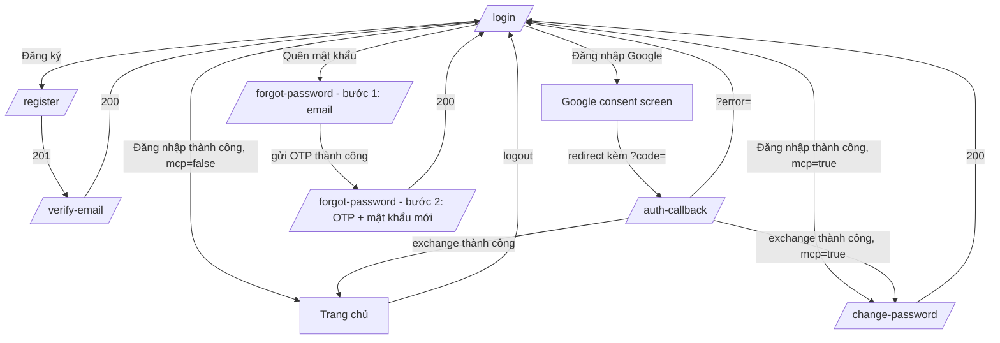

# Vantix Frontend — Phase 1: Auth UI

> **Trạng thái:** Thiết kế — dùng để code theo. Không có API design/ERD — mọi hợp đồng API tham chiếu `P1_auth_api_design.md`, tài liệu này chỉ mô tả màn hình, luồng điều hướng, convention và best practice riêng cho phần Auth.
> **Liên quan:** `P0_frontend_setup.md` (stack, API client, convention dùng chung), `P1_auth_api_design.md` (A01–A14), mockup UXMagic: Login, Visily: Register + Forgot Password (đang làm).

---

## 1. Mục tiêu

Dựng đủ giao diện cho toàn bộ vòng đời tài khoản: đăng ký → xác thực email → đăng nhập (email/mật khẩu hoặc Google) → quên/đổi mật khẩu → đăng xuất, cộng thêm luồng ép đổi mật khẩu bắt buộc cho STAFF. Không có màn hình riêng cho ADMIN tạo STAFF ở phase này (xem mục 6, để dành P2 admin area).

---

## 2. Danh sách màn hình

| # | Màn hình | Route | Tương ứng API |
|---|---|---|---|
| 1 | Đăng nhập | `/login` | A04, A05 (nút Google) |
| 2 | Đăng ký | `/register` | A01 |
| 3 | Xác thực email (nhập OTP) | `/verify-email` | A02, A03 (gửi lại) |
| 4 | Quên mật khẩu — nhập email | `/forgot-password` | A10 |
| 5 | Đặt lại mật khẩu — nhập OTP + mật khẩu mới | `/forgot-password` (đổi state, không đổi route) | A11 |
| 6 | OAuth callback (trang trung gian) | `/auth-callback` | A07 |
| 7 | Đổi mật khẩu bắt buộc (STAFF) | `/change-password` | A12 |
| 8 | Đổi mật khẩu chủ động (trong trang tài khoản) | `/account/security` | A12 |
| 9 | Component dùng chung: menu tài khoản (avatar + dropdown logout) | nằm trong `Header`, không phải route riêng | A09, A13 |

**Màn hình 4 và 5 dùng chung 1 route, đổi qua lại bằng local state** — đúng theo mockup Prompt 6 đã duyệt trước đó (2 "state" trong cùng 1 card), và đúng bản chất nghiệp vụ: A10/A11 là một vòng đời liền mạch (đã ghi rõ ở `P1_auth_api_design.md` mục A10), không phải 2 trang độc lập.

---

## 3. Luồng điều hướng

**Lưu ý luồng `change-password` bắt buộc (mcp=true):** sau khi đăng nhập/exchange thành công mà `user.mustChangePassword = true`, **chuyển hướng ngay**, không cho vào `Home`. Đây không chỉ là UX — Gateway sẽ chặn (`9004`) mọi API ngoài allowlist nếu access token còn mang `mcp=true`, nên nếu UI không tự chuyển hướng, người dùng sẽ gặp lỗi khó hiểu ở hầu hết thao tác khác.

---

## 4. Chi tiết từng màn hình

### 4.1 Login (`/login`)

Theo đúng mockup đã duyệt: card căn giữa, logo phía trên, email + password, link "Forgot password?", nút "Sign in" (accent), divider "or", nút "Continue with Google" (outline), dòng "Don't have an account? Sign up".

**Hành vi:**
- Submit gọi `POST /auth/login` qua `useMutation`.
- `onSuccess`: lưu `accessToken` + `user` vào Zustand store; nếu `user.mustChangePassword` → `router.push("/change-password")`; ngược lại → `router.push("/")`.
- `onError`: hiển thị `error.response.data.message` trong 1 alert/banner phía trên form (không dùng toast cho lỗi login — người dùng cần thấy ngay, không bị trôi mất).
- Nút "Continue with Google": **không** gọi API bằng JS — là thẻ `<a href="...">` điều hướng thẳng trình duyệt tới `GET {NEXT_PUBLIC_API_BASE_URL}/oauth2/authorization/google` (route của Spring Security, không phải JSON API). Dùng `<a>`, không dùng `fetch`/`axios`, vì đây là điều hướng toàn trang (nguyên lý y hệt vì sao A05/A06 trả `302`).

### 4.2 Register (`/register`)

Theo mockup Prompt 5: full name, email, password (kèm helper text độ mạnh), nút "Create account", nút Google tương tự Login.

**Hành vi:**
- Submit `POST /auth/register`. `onSuccess` (201) → `router.push("/verify-email?email=" + encodeURIComponent(email))` (truyền email qua query param để màn verify không bắt gõ lại).
- Validate password dùng chung `registerSchema` ở `P0_frontend_setup.md` mục 7.

### 4.3 Verify Email (`/verify-email`)

**Chưa có mockup riêng** — dùng lại bố cục "nhập OTP" giống state 2 của Forgot Password (6 ô số, nút submit, link "Gửi lại mã" kèm đếm ngược 60s).

**Hành vi:**
- Đọc `email` từ query param (đổ sẵn vào field ẩn, hiển thị dạng text "Mã đã gửi tới {email}").
- Submit `POST /auth/verify-email {email, otp}`. `onSuccess` → `router.push("/login")` kèm thông báo "Xác thực thành công, hãy đăng nhập".
- Nút "Gửi lại": gọi `POST /auth/resend-verification {email}`, luôn hiển thị cùng 1 thông báo thành công bất kể email có hợp lệ hay không (đúng hành vi A03 trả `200` im lặng) — **không** dựa vào response để suy luận gì thêm về tài khoản.
- Đếm ngược 60 giây bằng state cục bộ (`setInterval`), disable nút trong lúc đếm — **chỉ là UX**, không thay thế cơ chế cooldown thật ở backend (Redis); nếu người dùng mở 2 tab, backend vẫn là nguồn chặn thật sự.

### 4.4 Forgot Password (`/forgot-password`, 2 state)

Theo mockup Prompt 6 đầy đủ:

- **State 1** (mặc định): chỉ 1 field email, nút "Send reset code". Submit `POST /auth/forgot-password`. `onSuccess` → chuyển sang State 2, lưu `email` vào state cục bộ của component (không cần query param vì không chuyển route).
- **State 2**: 6 ô OTP + field mật khẩu mới + nút "Reset password" + link "Resend" có đếm ngược. Submit `POST /auth/reset-password {email, otp, newPassword}`. `onSuccess` → `router.push("/login")` kèm thông báo thành công.
- Component OTP 6 ô: mỗi ô `maxLength=1`, tự `focus()` sang ô kế khi gõ xong 1 ký tự, tự lùi focus khi bấm Backspace ở ô rỗng — UX chuẩn OTP, không bắt người dùng tự bấm Tab.

### 4.5 OAuth Callback (`/auth-callback`)

Trang **trung gian, không có UI tương tác** — chỉ hiện spinner "Đang đăng nhập..." trong lúc xử lý.

**Hành vi:**
- Đọc query param `code` hoặc `error` (do A06 redirect về).
- Có `error` → hiển thị thông báo lỗi tương ứng (đọc `message` tĩnh theo mã, vì đây là lỗi nằm trên URL chứ không phải response API — xem bảng mã ở `P1_auth_api_design.md` mục A06), rồi `router.push("/login")` sau vài giây.
- Có `code` → gọi `POST /auth/oauth2/exchange {code}`. `onSuccess` → giống luồng login (kiểm tra `mcp`, điều hướng Home hoặc Change Password). `onError` (ví dụ `2506` code hết hạn do người dùng back/refresh trang này) → thông báo lỗi, `router.push("/login")`.
- **Bẫy cần tránh:** `useEffect` gọi exchange phải chạy **đúng một lần** (dependency array rỗng `[]`, hoặc dùng ref chặn gọi lại) — React Strict Mode ở dev gọi `useEffect` 2 lần, và vì `code` dùng một lần duy nhất (TTL 60s, xóa khỏi Redis ngay khi dùng), gọi lần 2 sẽ luôn nhận `2506` dù lần 1 đã thành công.

### 4.6 Change Password — bắt buộc (`/change-password`)

**Khác `/account/security` (mục 4.7) ở chỗ:** không có nút "Hủy"/"Quay lại" — người dùng **bị kẹt** ở trang này cho tới khi đổi xong, đúng tinh thần ép buộc của `mcp=true`. Route này cũng nên tự kiểm tra: nếu `user.mustChangePassword === false` (đã đổi xong hoặc không cần), tự `redirect` về Home — tránh người dùng vào thẳng URL khi không cần.

**Hành vi:** giống `/account/security` (dùng chung 1 component form, khác nhau ở phần khung bao ngoài/có nút hủy hay không) — xem mục 4.7.

### 4.7 Change Password — chủ động (`/account/security`)

Form: `oldPassword`, `newPassword`, nút "Đổi mật khẩu".

**Hành vi:**
- Submit `PATCH /auth/change-password`. `onSuccess` → vì backend đã **thu hồi toàn bộ refresh token**, access token hiện tại (dù còn hạn 15 phút) sẽ không refresh được nữa — chủ động `clear()` Zustand store và `router.push("/login")` kèm thông báo "Đổi mật khẩu thành công, vui lòng đăng nhập lại", **không** cố giữ phiên hiện tại.
- Lỗi `2403 PASSWORD_NOT_SET` (tài khoản chỉ đăng nhập Google): hiển thị thông báo kèm link trỏ sang `/forgot-password` thay vì chỉ hiện message thô — đúng gợi ý trong `message` của backend ("hãy dùng chức năng quên mật khẩu để đặt").

### 4.8 Account menu (component, không phải route)

Avatar + tên hiển thị ở góc phải `Header` (lấy từ `UserResponse` trong store). Dropdown gồm: "Tài khoản" (→ `/account/security`), "Đăng xuất".

**Hành vi đăng xuất:** gọi `POST /auth/logout` trước (để backend thu hồi refresh token/xóa cookie), **rồi mới** `clear()` store và điều hướng — không làm ngược lại thứ tự, nếu không request logout sẽ thiếu `Authorization` header do store đã bị xóa trước.

---

## 5. Component dùng chung của Phase 1

| Component | Dùng ở |
|---|---|
| `AuthCard` | Khung card trắng bo góc, logo phía trên — base cho Login/Register/Forgot Password |
| `OtpInput` | 6 ô nhập OTP, dùng ở Verify Email và Forgot Password state 2 |
| `PasswordInput` | Input có icon toggle hiện/ẩn mật khẩu, dùng ở mọi field password |
| `GoogleButton` | Nút outline kèm icon Google, bản chất là thẻ `<a>` (mục 4.1) |
| `ResendCountdown` | Nút + đếm ngược 60s dùng chung cho "Gửi lại OTP" |

---

## 6. Ngoài phạm vi Phase 1

- **Màn hình ADMIN tạo tài khoản STAFF (A14)** — để ở phần admin area, lập kế hoạch cùng lúc với P2 admin screens (vì cùng nhóm người dùng ADMIN, tránh tách lẻ).
- **Đổi email, xem lịch sử đăng nhập, bật 2FA** — không nằm trong scope P1 backend, không làm UI cho thứ chưa có API.

---

## 7. Checklist hoàn thành Phase 1 (frontend)

- [ ] Luồng đăng ký → verify email → login chạy trơn tru với tài khoản thật tạo qua UI (không qua Bruno).
- [ ] Login Google end-to-end qua UI (bấm nút thật, không gọi API tay).
- [ ] Quên mật khẩu → đặt lại → login bằng mật khẩu mới, qua UI.
- [ ] STAFF (seed sẵn hoặc tạo qua Bruno) login lần đầu bị ép sang `/change-password`, không vào được trang khác.
- [ ] F5 lại trang bất kỳ sau khi login vẫn giữ được phiên (nhờ silent refresh ở `P0_frontend_setup.md` mục 5), không bị văng về `/login`.
- [ ] Logout xóa đúng cookie, token cũ không dùng lại được (test bằng DevTools Network, không chỉ tin UI).

---

*Hết tài liệu Phase 1. Bước tiếp theo: `P2_product_ui_plan.md`.*
