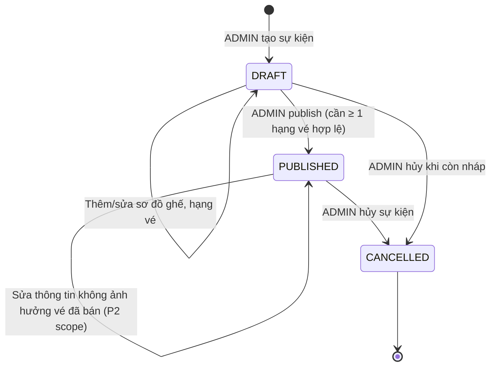
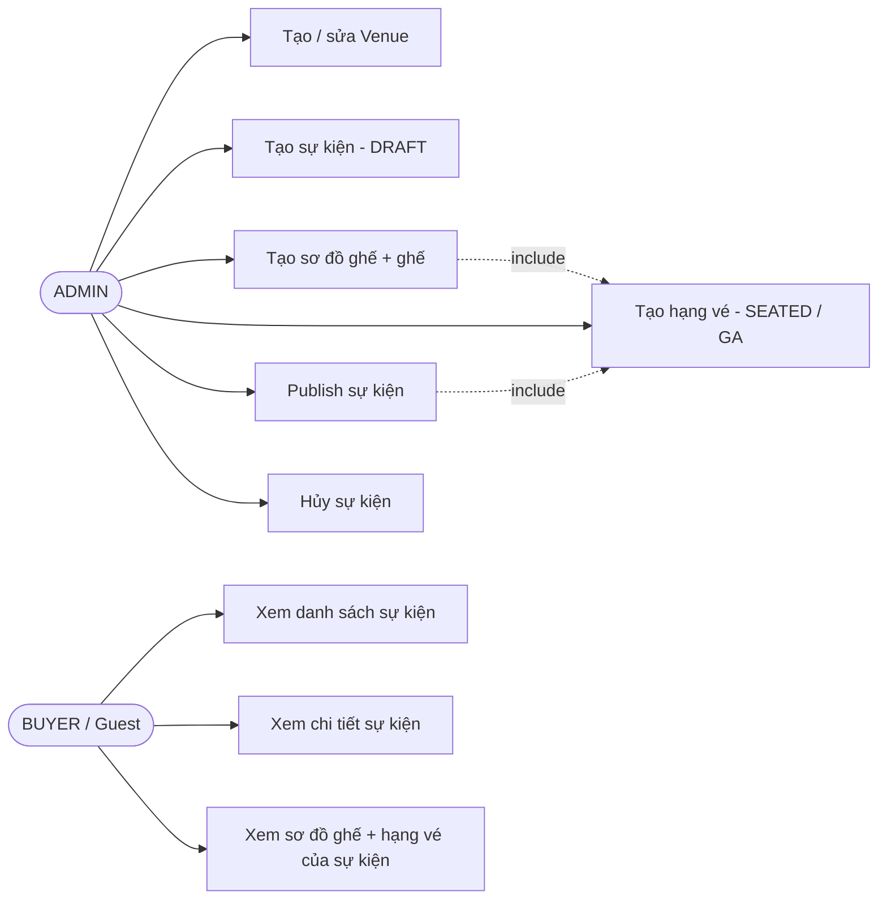
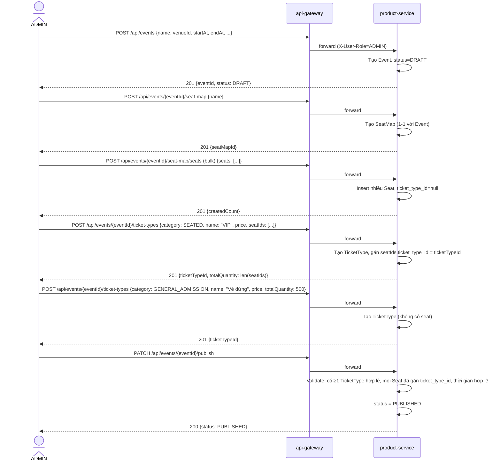
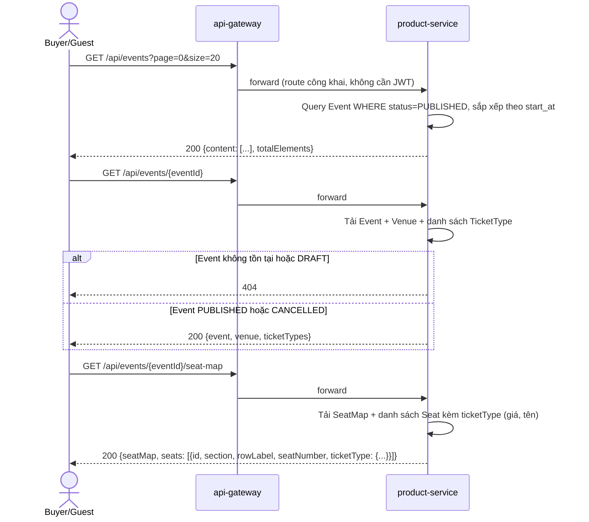
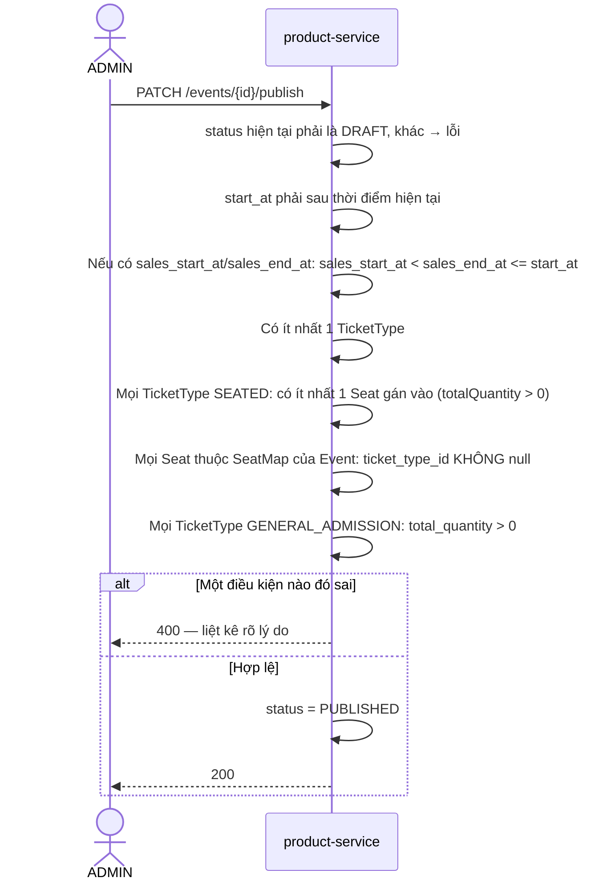

# Vantix — Phase 2: Product (Catalog: sự kiện, sơ đồ ghế, GA) — Tài liệu thiết kế

> **Trạng thái:** Thiết kế — dùng để code theo, chưa phải tài liệu tổng kết sau khi làm xong.
> **Liên quan:** `00_roadmap_phases_v1.md` (mục P2), `P0_infrastructure_summary.md`, `P1_auth_design.md`/`P1_auth_api_design.md`

---

## 1. Quyết định thiết kế đã chốt (bối cảnh cho các phần sau)

| # | Quyết định |
|---|---|
| 1 | Product chỉ đọc là chính, ghi ít (chỉ ADMIN thiết lập). Không xử lý giữ chỗ (hold) — đó là việc của Order (P3) |
| 2 | GA (General Admission) là **một kho số lượng phẳng**, không chia khu vực con ở giai đoạn này |
| 3 | Giá niêm yết bằng **USD** (do giới hạn Stripe sandbox, theo FR5) |
| 4 | Một sự kiện (`Event`) có thể có **cả hai** loại hạng vé cùng lúc: SEATED (có số ghế) và GENERAL_ADMISSION (GA) — theo FR3 |
| 5 | Sơ đồ ghế (`SeatMap`) thuộc về **Event**, không thuộc `Venue` — vì cách sắp ghế có thể khác nhau giữa các sự kiện dù cùng địa điểm. Một `Venue` có thể được nhiều `Event` dùng lại |
| 6 | Dữ liệu ghế ở P2 là **dữ liệu tĩnh** (ghế nào tồn tại, thuộc hạng vé nào) — **không** phản ánh ghế nào đã bán/đang giữ. Trạng thái giao dịch của ghế (HELD/SOLD) là dữ liệu của Order (P3), Product không lưu. Đây là điểm cần làm rõ cơ chế đồng bộ hiển thị ở P3 (xem mục 6) |
| 7 | Số lượng (`total_quantity`) trên `TicketType`: với GA là số nhập tay (kho vé); với SEATED là **giá trị dẫn xuất** từ số ghế thực tế được gán vào hạng vé đó, không nhập tay riêng — tránh hai nguồn sự thật lệch nhau |
| 8 | API đọc catalog (danh sách/chi tiết sự kiện) là **công khai**, không cần đăng nhập — duyệt sự kiện giống một trang thương mại điện tử thông thường. Chỉ hành động mua/giữ chỗ (Order, P3) mới cần JWT |
| 9 | API ghi (tạo/sửa sự kiện, sơ đồ ghế, hạng vé) chỉ **ADMIN** — theo đúng mô hình Trust-The-Gateway đã dùng ở P1 (đọc `X-User-Role` do Gateway inject) |
| 10 | `product-service` có database Postgres riêng (`product_service`), theo nguyên tắc database-per-service đã chốt ở roadmap mục 3.4 |

---

## 2. Vòng đời `Event`



- **DRAFT**: BUYER không thấy (API danh sách chỉ trả `PUBLISHED`). ADMIN tự do thêm/sửa/xóa sơ đồ ghế và hạng vé.
- **PUBLISHED**: BUYER thấy và mua được (ở P3). Điều kiện để publish: có ít nhất 1 `TicketType` (SEATED có ghế gán, hoặc GA có `total_quantity > 0`), có `start_at`/`sales_start_at`/`sales_end_at` hợp lệ (xem mục 5.3 validate).
- **CANCELLED**: BUYER vẫn xem được (để biết sự kiện đã hủy) nhưng không mua được. Trigger hoàn tiền 100% cho vé đã bán (FR4) là việc của Order/Payment ở P4 — Product chỉ phát tín hiệu trạng thái, **chưa quyết cơ chế đồng bộ** (xem mục 6, backlog #1).
- P2 **không** có trạng thái sự kiện đã diễn ra xong (`COMPLETED`) — để dành giai đoạn sau nếu cần phân biệt hiển thị.

---

## 3. Use case tổng quát



**Ghi chú:** Buyer không bắt buộc đăng nhập để xem (mục 1, quyết định #8). Venue không gắn với một sự kiện cụ thể nên có thể dùng lại.

---

## 4. ERD

```mermaid
erDiagram
    VENUES ||--o{ EVENTS : "tổ chức tại"
    EVENTS ||--o| SEAT_MAPS : "có (nếu có vé SEATED)"
    EVENTS ||--o{ TICKET_TYPES : "có nhiều"
    SEAT_MAPS ||--o{ SEATS : "gồm nhiều"
    TICKET_TYPES ||--o{ SEATS : "gán cho (chỉ loại SEATED)"

    VENUES {
        UUID id PK
        VARCHAR name
        VARCHAR address
        VARCHAR city
        TIMESTAMPTZ created_at
        TIMESTAMPTZ updated_at
    }

    EVENTS {
        UUID id PK
        UUID venue_id FK
        VARCHAR name
        TEXT description
        TIMESTAMPTZ start_at "thời gian diễn"
        TIMESTAMPTZ end_at
        TIMESTAMPTZ sales_start_at "nullable — null = mở bán ngay khi publish"
        TIMESTAMPTZ sales_end_at "nullable — null = mở bán đến lúc start_at"
        VARCHAR status "DRAFT | PUBLISHED | CANCELLED"
        VARCHAR banner_image_url "nullable"
        TIMESTAMPTZ created_at
        TIMESTAMPTZ updated_at
        TIMESTAMPTZ deleted_at "nullable — soft delete"
    }

    SEAT_MAPS {
        UUID id PK
        UUID event_id FK UK "1-1 với Event, unique"
        VARCHAR name "vd: Sơ đồ chính"
        TIMESTAMPTZ created_at
    }

    SEATS {
        UUID id PK
        UUID seat_map_id FK
        UUID ticket_type_id FK "nullable lúc tạo ghế thô, bắt buộc trước khi publish"
        VARCHAR section "vd: A, VIP, Tầng 1"
        VARCHAR row_label "vd: A, B, 12"
        VARCHAR seat_number "vd: 01, 02"
        VARCHAR display_label "vd: A-12 — có thể suy ra nhưng lưu sẵn để truy vấn nhanh"
        VARCHAR status "ACTIVE | INACTIVE — trạng thái CATALOG, KHÔNG phải trạng thái bán"
    }

    TICKET_TYPES {
        UUID id PK
        UUID event_id FK
        VARCHAR category "SEATED | GENERAL_ADMISSION"
        VARCHAR name "vd: VIP, Standard, Vé đứng"
        NUMERIC price "USD, 2 chữ số thập phân"
        INT total_quantity "GA: nhập tay; SEATED: dẫn xuất = COUNT(seats)"
        TIMESTAMPTZ created_at
        TIMESTAMPTZ updated_at
    }
```

**Ghi chú thiết kế:**
- `SEAT_MAPS.event_id` là unique — mỗi Event có tối đa 1 sơ đồ ghế (đơn giản hóa P2; sự kiện nhiều khu vực tách sơ đồ để sau).
- `SEATS.ticket_type_id` nullable lúc ADMIN mới tạo ghế thô (chưa gán giá), nhưng **bắt buộc khác null** với mọi ghế trước khi publish — validate ở bước publish (mục 5.3).
- Không có bảng nối nhiều-nhiều giữa `TICKET_TYPES` và `SEATS` vì một ghế chỉ thuộc đúng 1 hạng vé tại một thời điểm (quan hệ 1-nhiều từ `TICKET_TYPES`).
- `SEATS.status` chỉ phản ánh ghế có **tồn tại và dùng được trong catalog** hay không (ví dụ ghế hỏng → `INACTIVE`), **không** phải trạng thái "đã bán"/"đang giữ" — tránh nhầm với dữ liệu giao dịch của Order.
- Không có `deleted_at` ở `VENUES`/`SEAT_MAPS`/`SEATS`/`TICKET_TYPES` ở P2 — xóa cứng chấp nhận được vì chỉ ADMIN thao tác lúc còn `DRAFT` (ràng buộc ở tầng service, chưa cần soft-delete).

---

## 5. Sequence diagram — các luồng chính

### 5.1 ADMIN dựng một sự kiện đầy đủ (Venue có sẵn → publish)



### 5.2 BUYER duyệt và xem chi tiết sự kiện



**Lưu ý:** response `seat-map` ở P2 **không có trường trạng thái bán/giữ** cho từng ghế — đây là dữ liệu tĩnh thuần catalog. Khi tích hợp với Order ở P3, cần quyết định: (a) BUYER gọi thẳng Order để lấy trạng thái real-time rồi merge ở frontend, hay (b) Product expose thêm một API tổng hợp gọi ngược sang Order. Xem backlog #2.

### 5.3 Validate khi publish (chi tiết hóa bước trong 5.1)



---

## 6. Backlog cần quyết ở bước thiết kế API chi tiết (chưa chặn P2)

1. **Trigger hoàn tiền khi ADMIN hủy sự kiện (FR4):** Order/Payment cần biết Event chuyển `CANCELLED` để hoàn 100% bất kể thời điểm. Đồng bộ qua Kafka (`event.cancelled`, Product publish, Order consume) hay Order tự gọi REST kiểm tra status lúc xử lý? Quyết ở P4 theo đúng nguyên tắc async cho luồng không cần phản hồi ngay (roadmap mục 3.3).
2. **Đồng bộ trạng thái ghế real-time giữa Product (catalog tĩnh) và Order (hold/sold):** cách BUYER thấy "ghế nào còn trống" khi xem sơ đồ ghế — cần làm rõ ở P3 khi thiết kế Hold, theo đúng ghi chú đã có sẵn ở roadmap mục 2.
3. **Sửa sự kiện sau khi đã PUBLISHED và có vé bán:** P2 giả định ADMIN chỉ sửa thông tin không ảnh hưởng vé (mô tả, banner). Sửa giá/số lượng sau khi đã bán vé chưa có quy tắc — để dành nếu phát sinh nhu cầu thật.
4. **Phân trang & lọc danh sách sự kiện:** P2 chỉ cần phân trang cơ bản; lọc theo thành phố/thời gian/từ khóa có thể bổ sung khi có yêu cầu thật từ frontend.
5. **Ảnh sự kiện (`banner_image_url`):** P2 chỉ lưu URL (upload file thật — S3/Cloudinary — không nằm trong phạm vi P2, để dành nếu cần).

---

## 7. API dự kiến (chốt chi tiết khi viết file `P2_product_api_design.md`)

| Method | Path | Auth | Mô tả |
|---|---|---|---|
| POST | `/api/venues` | ADMIN | Tạo venue |
| GET | `/api/venues` | Công khai | Danh sách venue (hỗ trợ ADMIN chọn khi tạo event) |
| POST | `/api/events` | ADMIN | Tạo sự kiện (DRAFT) |
| PATCH | `/api/events/{id}` | ADMIN | Sửa thông tin sự kiện |
| PATCH | `/api/events/{id}/publish` | ADMIN | Publish (DRAFT → PUBLISHED) |
| PATCH | `/api/events/{id}/cancel` | ADMIN | Hủy sự kiện |
| GET | `/api/events` | Công khai | Danh sách sự kiện PUBLISHED, phân trang |
| GET | `/api/events/{id}` | Công khai | Chi tiết sự kiện + venue + ticket types |
| POST | `/api/events/{id}/seat-map` | ADMIN | Tạo sơ đồ ghế cho event |
| POST | `/api/events/{id}/seat-map/seats` | ADMIN | Thêm ghế hàng loạt |
| GET | `/api/events/{id}/seat-map` | Công khai | Xem sơ đồ ghế + hạng vé từng ghế |
| POST | `/api/events/{id}/ticket-types` | ADMIN | Tạo hạng vé (SEATED gán seatIds, hoặc GA kèm totalQuantity) |
| PATCH | `/api/ticket-types/{id}` | ADMIN | Sửa giá/tên hạng vé |

---

*Hết tài liệu thiết kế P2. Bước tiếp theo: xác nhận các quyết định ở mục 1 và backlog mục 6 (đặc biệt #1, #2) → viết `P2_product_api_design.md` (request/response/lỗi/errorCode dải `3xxx` chi tiết từng API) → bắt đầu code `product-service`.*
