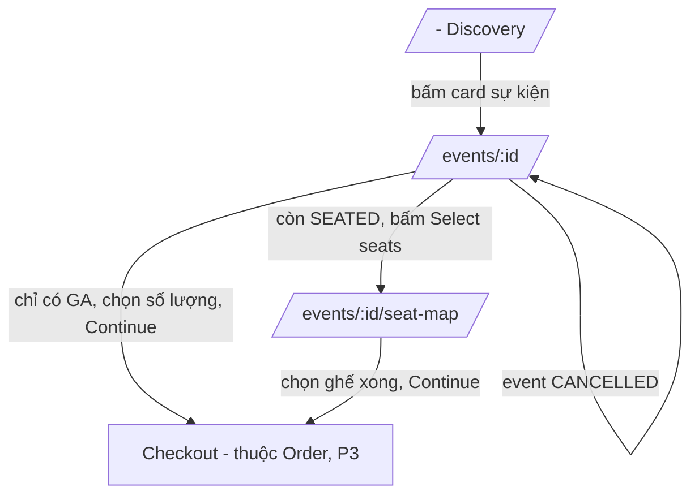
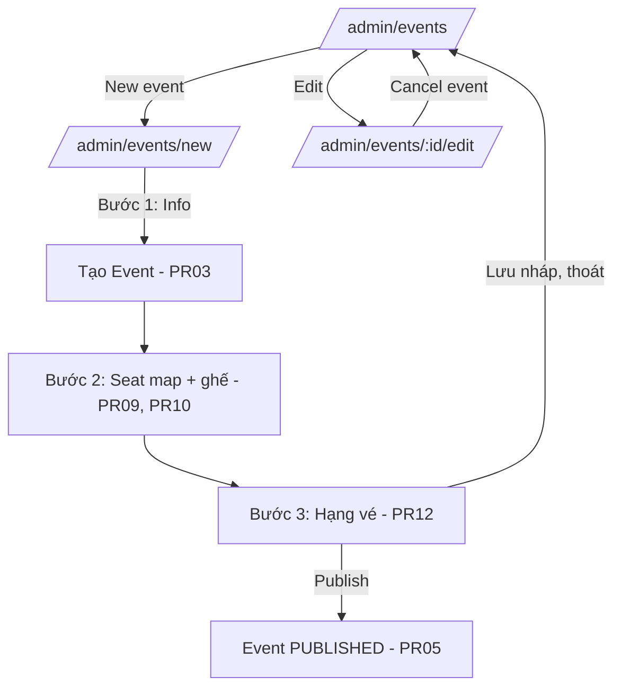

# Vantix Frontend — Phase 2: Product / Catalog UI

> **Trạng thái:** Thiết kế — dùng để code theo. Không có API design/ERD — tham chiếu `P2_product_api_design.md` cho mọi hợp đồng API. Tài liệu này mô tả màn hình, luồng điều hướng, convention và best practice riêng cho phần Catalog (buyer + admin).
> **Liên quan:** `P0_frontend_setup.md`, `P1_auth_ui_plan.md` (admin layout dùng chung guard role), mockup UXMagic: Home/Discovery, Event Detail, Seat Map Selection.

---

## 1. Mục tiêu

Hai nhóm màn hình tách biệt, dùng chung data layer (`lib/api/events.ts`, `venues.ts`) nhưng khác hẳn mục đích:

- **Buyer** (công khai, không cần đăng nhập): khám phá sự kiện, xem chi tiết, chọn ghế/vé.
- **Admin**: tạo và quản lý venue, event, sơ đồ ghế, hạng vé — giao diện thuần chức năng, không cần chăm chút thẩm mỹ bằng phía buyer.

---

## 2. Danh sách màn hình

### Buyer

| # | Màn hình | Route | Tương ứng API |
|---|---|---|---|
| 1 | Trang chủ / Discovery | `/` | PR07 |
| 2 | Chi tiết sự kiện | `/events/[eventId]` | PR08 |
| 3 | Chọn ghế / vé | `/events/[eventId]/seat-map` | PR11, PR08 (lấy lại `ticketTypes` cho phần GA) |

### Admin

| # | Màn hình | Route | Tương ứng API |
|---|---|---|---|
| 4 | Danh sách địa điểm | `/admin/venues` | PR02 |
| 5 | Tạo địa điểm (modal/dialog, không phải route riêng) | — | PR01 |
| 6 | Danh sách sự kiện (mọi trạng thái) | `/admin/events` | PR07 **không dùng được** — cần API riêng chỉ-ADMIN để thấy cả DRAFT (xem mục 6, điểm mở) |
| 7 | Tạo sự kiện — wizard nhiều bước | `/admin/events/new` | PR03, PR09, PR10, PR12, PR05 |
| 8 | Sửa sự kiện | `/admin/events/[eventId]/edit` | PR04, PR13, PR06 |

---

## 3. Luồng điều hướng — Buyer

`Checkout` chưa tồn tại (thuộc `order-service`, P3) — nút "Continue" ở cả 2 màn hình P2 tạm thời dẫn tới trang placeholder "Tính năng đang phát triển", **không** được giả lập API giỏ hàng giả ở đây.

---

## 4. Chi tiết màn hình Buyer

### 4.1 Discovery (`/`)

Theo mockup đã duyệt: thanh tìm kiếm + filter thành phố/ngày, grid card sự kiện 3 cột desktop / 1 cột mobile.

**Hành vi:**
- `useQuery(["events", page, filters], () => getEvents(params))` — gọi PR07. Filter thành phố/ngày là **UX phía frontend lọc lại danh sách đã tải**, hay gửi query param thật sang backend? PR07 hiện **chưa** hỗ trợ filter theo `city`/ngày (chỉ có `page`/`size`, xem `P2_product_api_design.md` mục 9 điểm 4 — để backend bổ sung sau nếu cần). Ở P2 frontend: filter thành phố **chỉ lọc trên tập dữ liệu trang hiện tại** (client-side), ghi rõ giới hạn này trong code comment — tránh hiểu nhầm là lọc toàn bộ dữ liệu.
- Card hiển thị: ảnh (`bannerImageUrl`, fallback ảnh mặc định nếu `null`), badge giá (`minPrice` → format `"From $" + minPrice`, ẩn badge nếu `null`), tên, ngày giờ (`startAt` format qua `date-fns`), `venue.name` + khu vực (field mới `neighborhood`, xem mục 7) + `venue.city`.
- Phân trang: nút "Xem thêm"/infinite scroll hay phân trang số trang? Chọn **"Xem thêm" (load more)** — đơn giản hơn, khớp cảm giác duyệt sự kiện kiểu mạng xã hội trong mockup, không cần component phân trang phức tạp.

### 4.2 Event Detail (`/events/[eventId]`)

Theo mockup đã duyệt, **đã sửa theo quyết định mới nhất**: bỏ ô Quantity khỏi các hạng vé `SEATED`.

**Hành vi hiển thị từng `TicketType` trong panel bên phải (nguồn: PR08 → `ticketTypes[]`):**

| `category` | Hiển thị |
|---|---|
| `SEATED` | Tên + giá, **không có** ô Quantity, thay bằng text phụ "Chọn ghế cụ thể" (không phải nút riêng cho từng hạng vé) |
| `GENERAL_ADMISSION` | Tên + giá + ô Quantity (+/-), đúng mockup gốc |

Một nút duy nhất bên dưới toàn bộ danh sách:
- `hasSeatMap === true` → nút **"Select seats"**, dẫn `/events/:id/seat-map`.
- `hasSeatMap === false` (event chỉ bán GA) → nút **"Continue"**, disabled nếu tổng số lượng GA đã chọn = 0.

**Trạng thái `CANCELLED`:** banner đỏ (đúng mockup), toàn bộ panel vé bị khóa — nút đổi thành "Ticketing unavailable" (disabled), đúng y hệt mockup đã duyệt.

### 4.3 Seat Map (`/events/[eventId]/seat-map`)

Theo mockup đã duyệt: lưới ghế nhóm theo `section`, panel bên phải "Your tickets" + tổng tiền + nút Continue.

**Giới hạn quan trọng cần biết trước khi code:** response PR11 (`GET /events/{id}/seat-map`) ở P2 **không có trường trạng thái bán/giữ** cho từng ghế (xem `P2_product_api_design.md` mục 0 — cột này chỉ được thêm ở P3 khi `order-service` publish Kafka). Hệ quả:

- Component ghế **chỉ có 2 trạng thái thật từ dữ liệu**: `available` (mặc định) và `selected` (local state khi người dùng bấm). **Không** có trạng thái `sold` lấy từ API — nếu muốn test UI trạng thái "đã bán" ở giai đoạn này, phải tự mock cứng vài ghế trong code demo, ghi rõ bằng comment `// TODO P3: thay bằng dữ liệu thật từ order.seat-status-changed`.
- Vẽ ghế: lưới CSS Grid theo `section` → `rowLabel` → `seatNumber`, **không cần** canvas/SVG phức tạp như mockup gợi ý ban đầu ở prompt — vì dữ liệu ghế hiện tại không có tọa độ x/y (backend chỉ lưu `section`/`row`/`number`, xem ERD P2), nên bố trí tự nhiên theo hàng/cột là đủ và đúng với dữ liệu thật đang có. Giữ phong cách thị giác giống mockup (ô vuông bo góc, đổi màu theo state) nhưng layout là grid thường, không phải vẽ tọa độ tự do.
- Panel "Your tickets" tổng hợp: ghế đã chọn (group theo `ticketType.name`) + số lượng GA đã chọn ở trang trước đó (truyền qua query param hoặc state toàn cục tạm thời — **không cần Zustand riêng**, vì chỉ sống trong phiên thao tác 1 lần, dùng `useState` ở layout cha của route này là đủ).

---

## 5. Luồng điều hướng & chi tiết màn hình Admin

### 5.1 Venues (`/admin/venues`)

Bảng danh sách (PR02) + nút "Add venue" mở `Dialog` chứa form (PR01). Không cần route riêng cho tạo mới — venue là thao tác đơn giản, dùng modal cho nhanh, đúng tinh thần "API ghi ít" đã ghi ở `P2_product_design.md`.

### 5.2 Tạo sự kiện — wizard 3 bước (`/admin/events/new`)

**Quyết định quan trọng:** đi theo đúng tuần tự bắt buộc của backend (Event phải tồn tại trước khi tạo SeatMap, SeatMap phải tồn tại trước khi thêm Seat, Seat phải tồn tại trước khi gán vào TicketType loại SEATED) — nên UI **không thể** là 1 form điền hết rồi submit 1 lần; phải là wizard thật, mỗi bước gọi API thật và nhận `id` dùng cho bước sau.

- **State giữa các bước:** lưu `eventId`/`seatMapId` vào `useState` ở component cha của wizard (hoặc URL query param `?eventId=...` để refresh trang giữa chừng không mất tiến độ — khuyến nghị dùng query param, vì ADMIN có thể lỡ F5).
- **Bước 1 — Thông tin sự kiện:** form PR03. Submit xong, event ở trạng thái `DRAFT`, chuyển sang Bước 2, giữ `eventId`.
- **Bước 2 — Sơ đồ ghế (tùy chọn):** ADMIN có thể **bỏ qua** bước này nếu sự kiện chỉ bán GA — thêm nút "Skip, this event has no seat map". Nếu làm: form tạo SeatMap (PR09), sau đó giao diện thêm ghế hàng loạt — **không bắt ADMIN gõ tay từng ghế**, cung cấp 1 form nhập nhanh kiểu "Section: VIP, Rows: A-C, Seats per row: 8" rồi tự sinh mảng `seats[]` ở client trước khi gọi PR10 (giảm thao tác lặp lại, nhưng vẫn gọi đúng 1 API bulk như thiết kế).
- **Bước 3 — Hạng vé:** form lặp lại nhiều lần (ADMIN thêm từng `TicketType` một qua PR12) — với SEATED, hiển thị lưới ghế vừa tạo ở Bước 2 để ADMIN **chọn bằng checkbox** (không gõ tay UUID), giống hệt kiểu tương tác của Seat Map bên buyer nhưng mục đích là "chọn để gán hạng vé" thay vì "chọn để mua".
- **Hoàn tất:** nút "Publish" gọi PR05; nếu nhận lỗi `3105` kèm `reasons[]`, hiển thị **toàn bộ danh sách lý do** (không chỉ lý do đầu tiên) trong 1 alert, để ADMIN sửa 1 lần đủ hết thay vì bị báo lỗi từng cái một qua nhiều lần bấm.

### 5.3 Sửa sự kiện (`/admin/events/[eventId]/edit`)

Form tương tự Bước 1 của wizard, nhưng **disable các field giới hạn** (`venueId`, `startAt`, `endAt`, `salesStartAt`, `salesEndAt`) khi `event.status !== 'DRAFT'` — đúng quy tắc PR04, disable ở UI để ADMIN không mất công điền rồi mới nhận lỗi `3102`. Có thêm nút "Cancel event" (PR06), yêu cầu xác nhận qua `Dialog` trước khi gọi API vì đây là hành động không thể hoàn tác.

---

## 6. Điểm mở cần xác nhận

1. **`/admin/events` cần thấy cả event `DRAFT`**, nhưng PR07 chỉ trả `PUBLISHED`. Hai hướng: (a) thêm query param `?status=` vào PR07 cho phép ADMIN xem mọi trạng thái (cần sửa backend), hoặc (b) tạm thời ADMIN chỉ thấy danh sách qua... hiện chưa có API nào khác. Đây là lỗ hổng thật trong kế hoạch, cần quay lại bổ sung ở `P2_product_api_design.md` trước khi code màn hình 6 — **chưa có cách làm nào khả thi với API hiện tại**, phải sửa backend trước.
2. **Form nhập nhanh "Rows A-C, 8 seats/row" ở Bước 2 wizard** là tôi tự đề xuất để giảm thao tác — không có trong mockup gốc, cần bạn duyệt trước khi code.

---

## 7. Phụ thuộc đang treo từ backend

- **`Venue.neighborhood`** (đã quyết ở mockup review nhưng chưa code): `VenueResponse`/`EventResponse.venue` cần thêm field này trước khi UI hiển thị đúng như mockup Discovery (`"Mission District · San Francisco"`). Cho tới khi có, UI chỉ hiển thị `city`, bỏ phần khu vực, không tự bịa dữ liệu.

---

## 8. Checklist hoàn thành Phase 2 (frontend)

- [ ] Discovery hiển thị đúng sự kiện đã tạo ở backend P2, "Load more" hoạt động.
- [ ] Event Detail: SEATED không còn ô Quantity, GA có ô Quantity; trạng thái CANCELLED khóa đúng toàn bộ panel vé.
- [ ] Seat Map: chọn/bỏ chọn ghế cập nhật đúng tổng tiền; ghế không có trạng thái "sold" giả (trừ phần mock có ghi TODO rõ ràng).
- [ ] Admin: tạo trọn vẹn 1 sự kiện qua UI (không qua Bruno) gồm cả SEATED lẫn GA, publish thành công, buyer thấy được ở Discovery.
- [ ] Admin: publish thiếu điều kiện hiển thị đủ danh sách `reasons`, không chỉ 1 dòng.

---

*Hết tài liệu Phase 2. Phase 3 (Order UI) chỉ lập kế hoạch khi `P3_order_api_design.md` phía backend đã có — tránh thiết kế UI cho API chưa tồn tại.*
